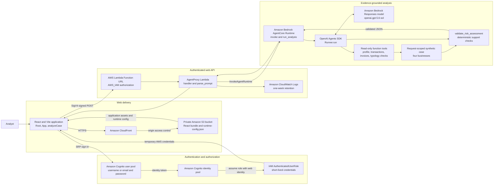
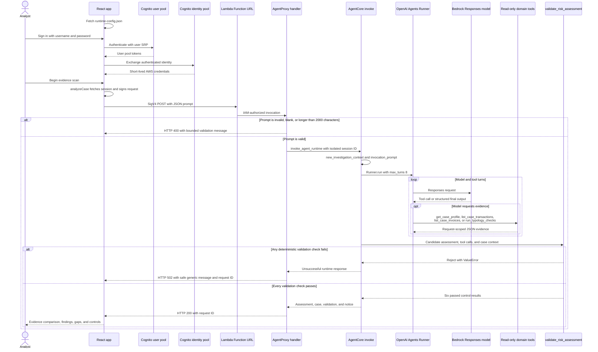

# System architecture

## Runtime architecture

## Request sequence and error paths

## Security and state boundaries

- The S3 bucket is private and is read through CloudFront origin access control.
- The Cognito user pool allows invited-user sign-in; self-service sign-up and
  MFA are disabled in the current CDK configuration.
- The browser receives short-lived credentials from the Cognito identity pool.
  It does not receive long-lived AWS or model credentials.
- The Lambda Function URL requires IAM authorization. The browser role is
  limited to invoking that function URL.
- The Lambda execution role is limited to the configured AgentCore runtime.
- Each analysis uses a new `runtimeSessionId` and rebuilds the synthetic case.
  There is no application database, durable case state, AgentCore memory,
  knowledge base, or gateway in the current configuration.
- Model output is not returned until deterministic support validation passes.

## Code references

- [`web/src/main.tsx`](../web/src/main.tsx) — runtime configuration and Cognito
  authenticator.
- [`web/src/api.ts`](../web/src/api.ts) — temporary credential retrieval and
  SigV4 request signing.
- [`web-infra/lib/aml-web-stack.ts`](../web-infra/lib/aml-web-stack.ts) — web
  hosting, Cognito, IAM, Lambda, and deployment resources.
- [`web-infra/lambda/handler.py`](../web-infra/lambda/handler.py) — prompt
  validation, AgentCore invocation, and safe HTTP errors.
- [`app/aml_grounded_agent/main.py`](../app/aml_grounded_agent/main.py) —
  AgentCore entry point, agent tools, model runner, and response boundary.
- [`app/aml_grounded_agent/aml_grounded_agent/domain.py`](../app/aml_grounded_agent/aml_grounded_agent/domain.py)
  — synthetic evidence, deterministic signals, and output validation.
