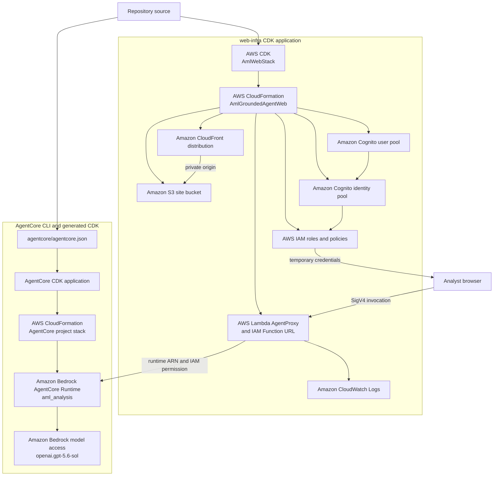

# AWS services and deployment topology

## Deployment view

## Service inventory

| AWS service | Role in this project | Key configuration |
| --- | --- | --- |
| Amazon CloudFront | Public HTTPS entry point for the analyst workspace | Redirects HTTP to HTTPS, compresses content, applies the managed security headers policy, and maps SPA 403/404 responses to `index.html` |
| Amazon S3 | Stores the built React application and generated `runtime-config.json` | Private bucket, S3-managed encryption, SSL enforced, public access blocked, CloudFront origin access control |
| Amazon Cognito user pools | Authenticates invited analysts | Username/email sign-in, user SRP auth, self-sign-up disabled, MFA currently off, one-hour access and ID tokens |
| Amazon Cognito identity pools | Exchanges the authenticated Cognito identity for AWS credentials | Unauthenticated identities disabled; maps users to `AuthenticatedUserRole` |
| AWS Identity and Access Management | Limits browser and Lambda permissions | Browser role can invoke only the IAM Function URL; Lambda role can invoke only the configured AgentCore runtime |
| AWS Lambda | Validates the web request and adapts it to AgentCore | Python 3.12 on Arm64, five-minute timeout, 512 MB memory, reserved concurrency of two |
| Lambda Function URLs | Exposes the adapter without API Gateway | `AWS_IAM` authentication, POST-only CORS for the CloudFront origin, buffered response mode |
| Amazon Bedrock AgentCore Runtime | Runs one isolated AML analysis invocation | Python 3.12 CodeZip runtime, HTTP protocol, IAM authorization, public network mode |
| Amazon Bedrock | Provides the configured Responses model | Model ID `openai.gpt-5.6-sol`; runtime role receives the project-scoped inference permission |
| Amazon CloudWatch Logs | Stores Lambda adapter logs | Dedicated `AgentProxyLogs` group with one-week retention |
| AWS CloudFormation | Creates and updates both infrastructure stacks | Synthesized through the web CDK application and the AgentCore-generated CDK application |

## Services intentionally not configured

The current `agentcore.json` contains no AgentCore memory, knowledge base,
gateway, credential provider, evaluator, policy engine, harness, dataset, or
payment manager. The application also has no DynamoDB, RDS, or other durable
case database. Case evidence is synthetic Python data rebuilt for each
invocation.

## Infrastructure references

- [`web-infra/lib/aml-web-stack.ts`](../web-infra/lib/aml-web-stack.ts)
- [`agentcore/agentcore.json`](../agentcore/agentcore.json)
- [`agentcore/cdk/bin/cdk.ts`](../agentcore/cdk/bin/cdk.ts)
- [`agentcore/cdk/lib/cdk-stack.ts`](../agentcore/cdk/lib/cdk-stack.ts)
- [`app/aml_grounded_agent/bedrock-invoke-policy.json`](../app/aml_grounded_agent/bedrock-invoke-policy.json)
