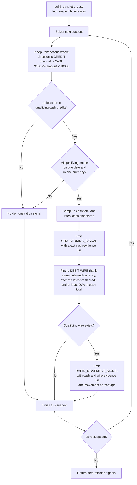
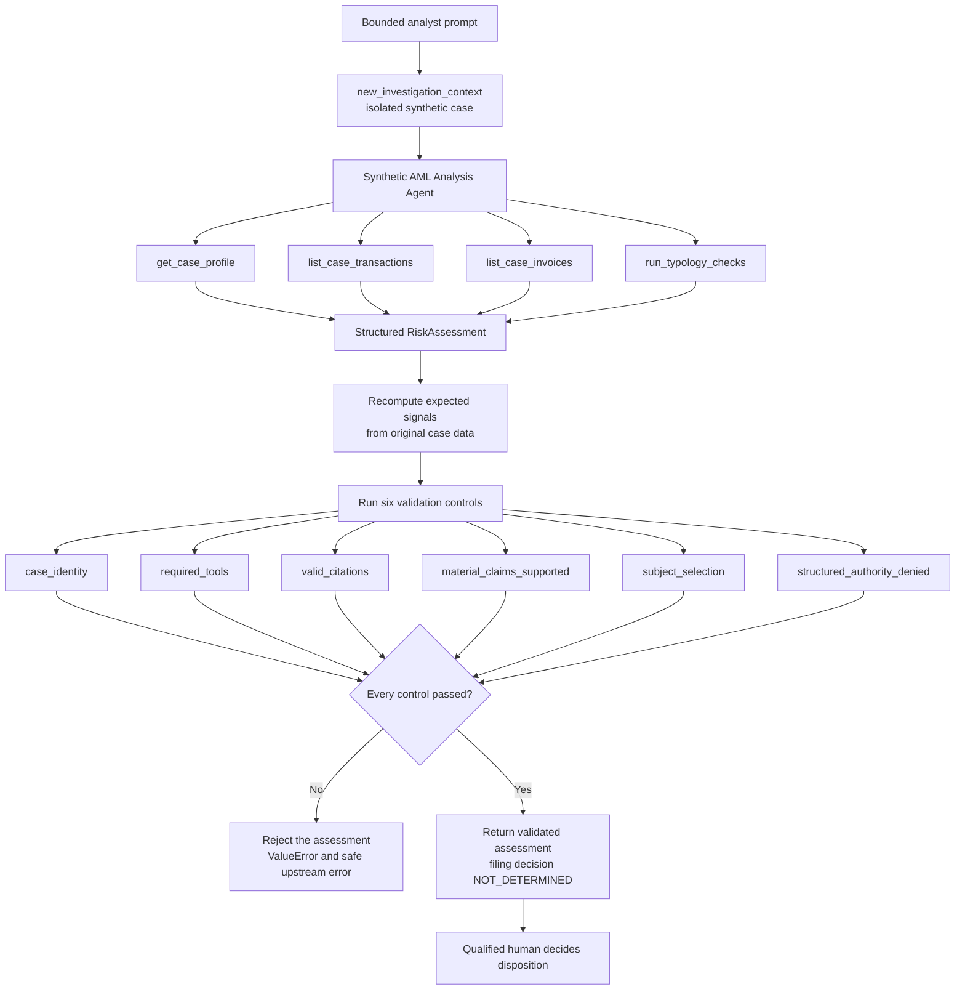

# AML demonstration and validation business logic

The rules below are transparent demonstration rules for a synthetic learning
case. They are not legal thresholds, production transaction-monitoring rules,
or proof of intent.

## Signal detection

### Demonstration thresholds

| Check | Rule in `detect_typology_signals` |
| --- | --- |
| Cash amount range | At least USD 9,000 and less than USD 10,000 |
| Cash count | At least three qualifying credits |
| Timing | Qualifying cash credits must occur on one calendar date |
| Currency | Qualifying cash credits must share one currency |
| Rapid outbound movement | A later same-day debit wire in the same currency must be at least 90% of the qualifying cash total |
| Invoice use | Invoices provide corroborating context and information gaps; they do not trigger the two deterministic signals |

For the included fixture, Felix Flowers has qualifying cash credits of
USD 9,200, USD 9,500, and USD 9,700, totaling USD 28,400. A later USD 27,900
wire moves 98.2% of that total, so Felix receives both signals. Larry Suds is
the narrative red herring: his cash activity totals USD 6,940 across smaller
collections and does not enter the demonstration range.

## Agent and deterministic control flow

## Validation controls

| Control | What must be true |
| --- | --- |
| `case_identity` | The assessment case ID equals the request-scoped case ID |
| `required_tools` | The model called profile, transaction, invoice, and deterministic typology tools |
| `valid_citations` | Every finding contains evidence IDs and every ID exists in the case transactions or invoices |
| `material_claims_supported` | Finding types, subject fields, evidence IDs, cash counts, totals, wire amount, and movement ratio match deterministic recomputation |
| `subject_selection` | Exactly one subject produces signals; the candidate selects that subject and identifies Larry Suds as the red herring |
| `structured_authority_denied` | `drafting_authorized` remains false and `filing_decision` remains `NOT_DETERMINED` |

The model supplies the explanation and recommended review steps, but it cannot
change the deterministic support fields. A failed control rejects the entire
assessment before it reaches the browser.

## Business logic references

- [`app/aml_grounded_agent/aml_grounded_agent/domain.py`](../app/aml_grounded_agent/aml_grounded_agent/domain.py)
- [`app/aml_grounded_agent/main.py`](../app/aml_grounded_agent/main.py)
- [`app/aml_grounded_agent/tests/test_domain.py`](../app/aml_grounded_agent/tests/test_domain.py)
- [`app/aml_grounded_agent/tests/test_runtime.py`](../app/aml_grounded_agent/tests/test_runtime.py)
- [`web-infra/tests/test_handler.py`](../web-infra/tests/test_handler.py)
